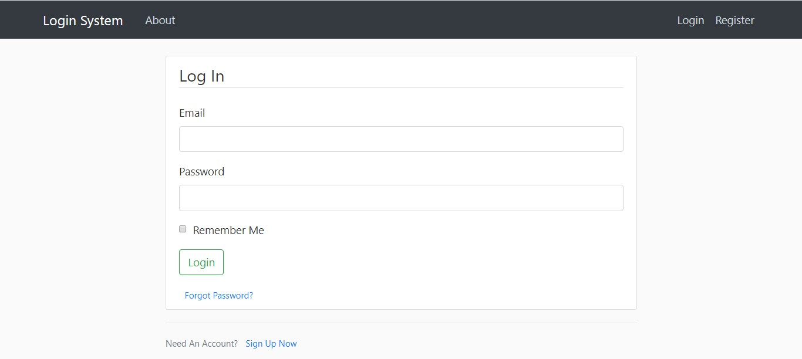
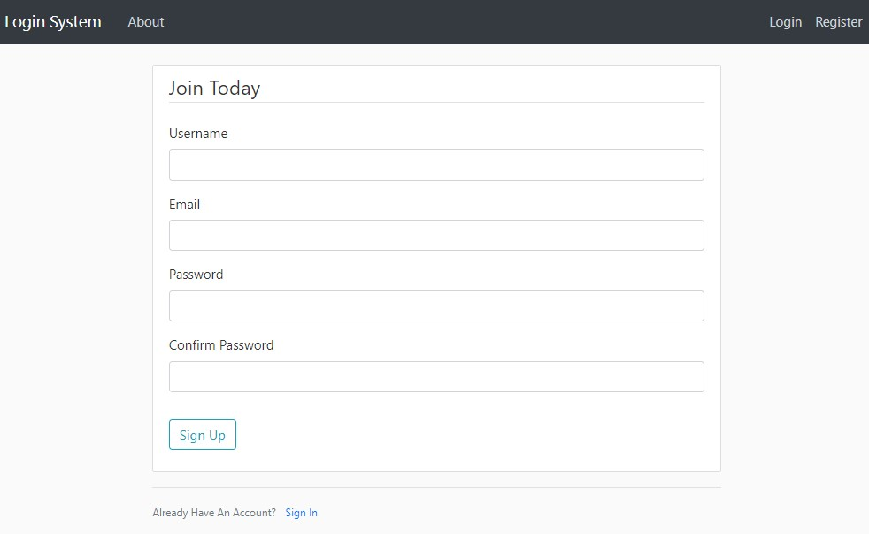
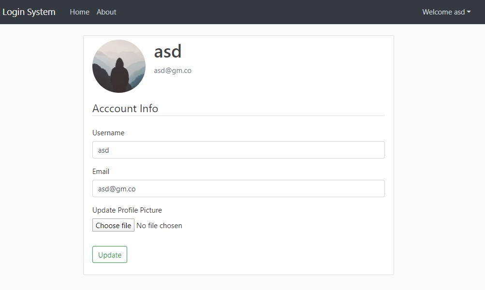
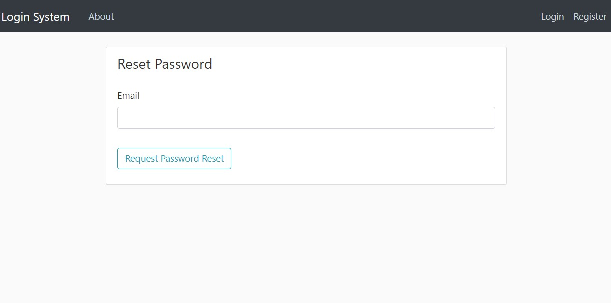

# User Login System

## Features

- User Authentication
- "Remember Me" Option
- Protected URL's
- Change User Settings such as Username, Email, Password and Profile Picture
- Forgot Password Functionality

## Installation

**1. Clone the repository**

```
git clone https://github.com/AdityaBagad/Flask-Boilerplates.git
```

**2. Installation of Dependencies**

```
cd User-Login-System

pip install -r requirements.txt
``` 

**3. Create the SQLite3 Database**

Enter the following in Python console

```
from login_system import db

from login_system.models import User

db.create_all()
```

**4. Run the Application**

```
python run.py
```

## Screenshots

**1. User Login Page**



**2. User Registration Page**



**3. User Account Page**

User can change their username, email, and their profile picture.



**4. Reset Password**


